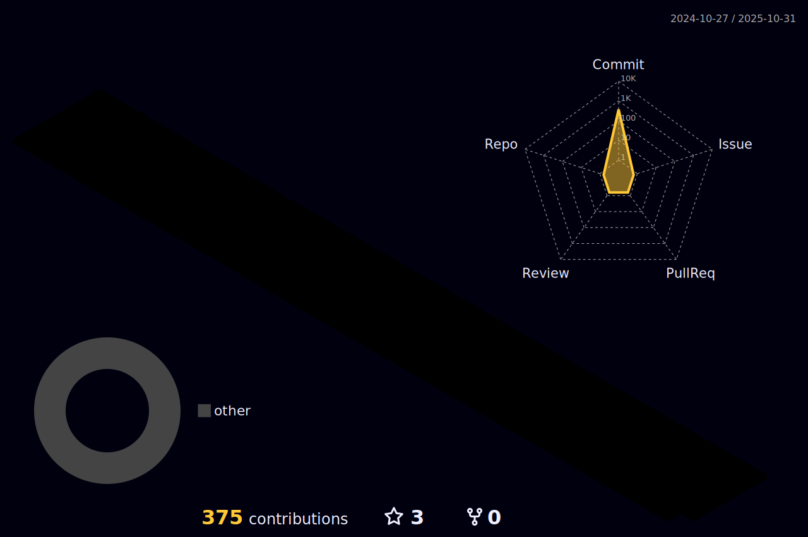

### 안녕하세요 권성한입니다👋

## Tools and Skills

## Projects

### 2024

### [itsComments](https://github.com/itsComments/itsComments-Extension)
- 웹페이지 어디에든 댓글을 달고 해당 댓글을 다른사람과 공유 할 수 있는 크롬 익스텐션

### [Word2Markdown](https://github.com/sunghankwon/W2M)
- docx로 작성된 문서를 markdown으로 변경해주는 웹 애플리케이션

---

